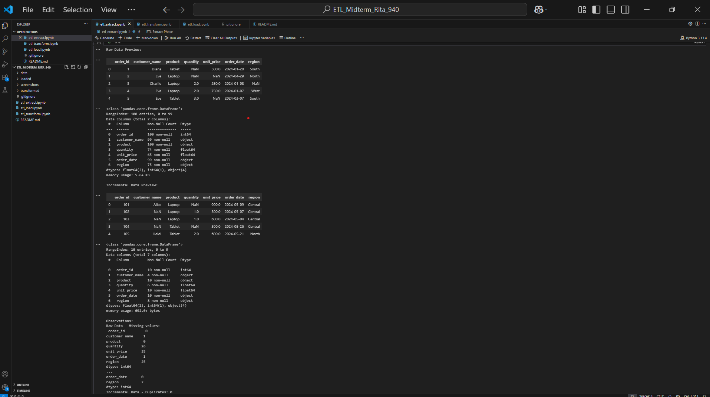
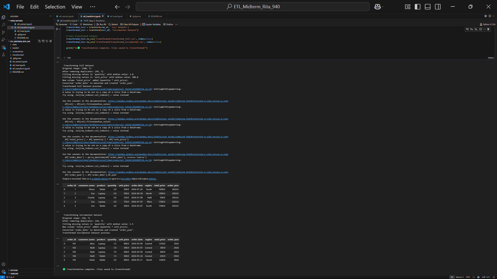
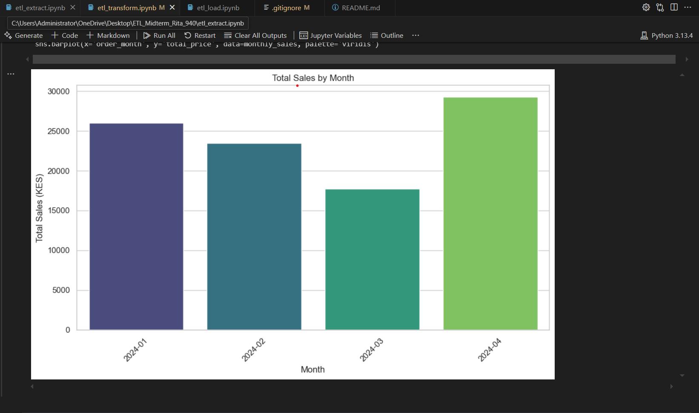
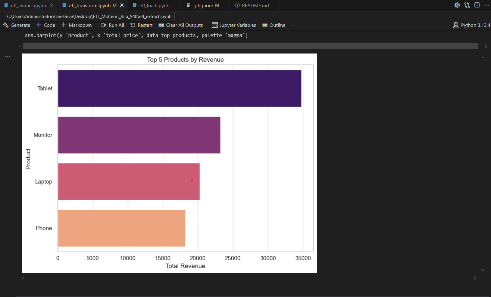
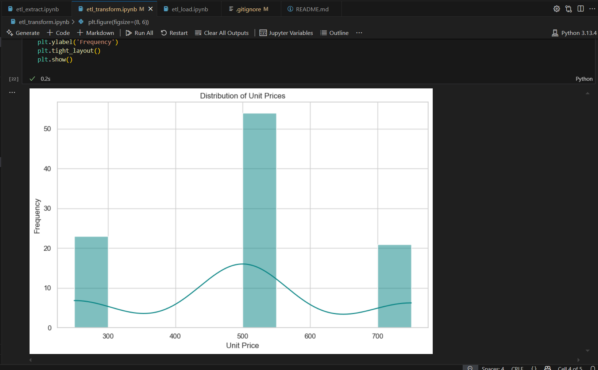
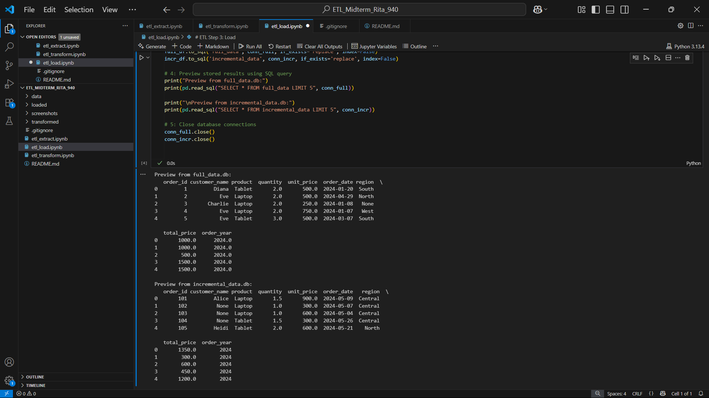

# ETL MIDTERM PROJECT – RITA

## PROJECT OVERVIEW
 
This project demonstrates a complete ETL (Extract, Transform, Load) process using Python and SQLite. The project simulates how sales data is extracted from source files, transformed to ensure data quality and enriched with new features and finally loaded into a structured database format for querying and analytics.

 ## Folder structure
  
 /data/
 
  ├── raw_data.csv                  - Original full dataset with sales records  
  └── incremental_data.csv          - Additional new records for incremental processing  

/transformed/

  ├── transformed_full.csv          - Cleaned and enhanced full dataset  
  └── transformed_incremental.csv   - Cleaned and enhanced incremental dataset  

/loaded/

  ├── full_data.db                  - SQLite database containing the full transformed data  
  └── incremental_data.db           - SQLite database containing the incremental data  

/screenshots/

  ├── extract_preview.png           - Preview from the data extraction phase  
  ├── transform_preview.png         - Output after applying data transformations  
  └── sql_preview.png               - Snapshot of the SQL query result after loading  

/etl_extract.ipynb/                 - Notebook for reading and inspecting the data 

/etl_transform.ipynb/               - Notebook for cleaning and transforming the data  

/etl_load.ipynb/                    - Notebook for loading the data into SQLite  

/README.md/                         - Documentation for the project and how to run it  

/.gitignore/                        - Lists files to exclude from version control 
	

## Dataset Description
 
The project uses two datasets:
1. raw_data.csv – the full historical dataset containing sales records.
2. incremental_data.csv – a smaller file representing newly added sales transactions.

These files typically contain the following fields:
- order_id
- product_id
- customer_id
- quantity
- unit_price
- order_date
- Any additional relevant fields

## ETL Process Breakdown
### 1. Extract Phase – etl_extract.ipynb 
- Loads raw_data.csv and incremental_data.csv from the data/ folder.
- Uses pandas to inspect structure (.info()), preview rows (.head()) and identify missing values and duplicates.
- Saves the datasets back into the data/ folder for consistency.

### 2. Transform Phase – etl_transform.ipynb
- Cleans and enriches both datasets using the following transformations:
  
  a) Removes duplicate records.
  
  b) Fills missing numeric values with column medians.

  c) Creates a new column total_price = quantity * unit_price.

  d) Converts the order_date column to datetime and extracts the order_year.
  
- Saves cleaned files to the transformed/ folder as transformed_full.csv and transformed_incremental.csv.

#### Visualizations

- **Bar Chart**: Total Sales by Month – shows revenue trends within 2024

- **Horizontal Bar Chart**: Top 5 Products by Revenue – highlights best-selling products

- **Histogram**: Distribution of Unit Prices – shows common pricing ranges

### 3. Load Phase – etl_load.ipynb
- Loads the transformed CSVs.
- Uses SQLite via pandas and sqlite3 to create two databases:
  - full_data.db
  - incremental_data.db
- Saves the databases in the loaded/ folder.
- Executes SQL queries (SELECT * FROM full_data LIMIT 5) to verify.

## Tools Used
- Python 3.x
- Jupyter Notebook
- Pandas
- SQLite3
- Git & GitHub

## How to Run the Project
1. Open the project folder in Jupyter Notebook.
2. Run each notebook in this order:
   - etl_extract.ipynb
   - etl_transform.ipynb
   - etl_load.ipynb
3. Check the results in:
   - transformed/ for CSV output
   - loaded/ for database output